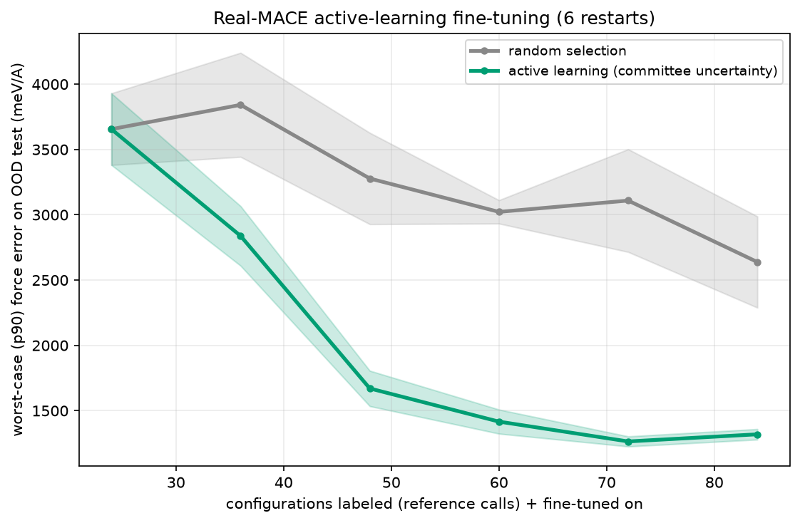

# MLIP1

**Active-learning fine-tuning of a machine-learning interatomic potential (MLIP) — the loop NVIDIA's ALCHEMI is built on, reproduced faithfully and honestly on a laptop.**

A committee of fine-tuned [MACE](https://github.com/ACEsuit/mace) foundation models selects which configurations to label with an expensive reference and fine-tune on. On the configurations that matter — the out-of-distribution regime a real molecular-dynamics run visits — this **cuts worst-case force error by 26–59% versus random selection at equal labeling budget, winning every paired restart at every budget.**



---

## The result

On a held-out **out-of-distribution** test set (the hard/deployment regime), a 3-member committee of fine-tuned MACE models, selecting configurations by force disagreement:

| configs labeled | 36 | 48 | 60 | 72 | 84 |
|:---|---:|---:|---:|---:|---:|
| worst-case (p90) force error, AL better than random | +26% | +49% | +53% | **+59%** | +50% |
| restarts where AL wins | 6/6 | 6/6 | 6/6 | 6/6 | 6/6 |

Both arms share the seed set, the bootstrap draws and the training seeds, so the
comparison is **paired** and the 24-label point is identical by construction. Active
learning wins every one of the 6 paired restarts at every budget — a one-sided sign
test gives **p = 0.016** at each point, which is a stronger statement than the mean
and its band. The effect also now shows in the median (+17%, +21%, +21% at the top
three budgets), not only the tail.

Alongside: real MACE fine-tuning cut held-out force error **~3×** (1121 → 374 meV/Å,
median on physical configs, validation split drawn from train — never test);
committee disagreement tracks force error at **Spearman 0.86**.

> **These numbers superseded an earlier run.** The first version of this experiment
> reported +35–62%. Three defects were later found and fixed — the fine-tuned models
> were silently losing the foundation's element table, the acquisition score was not
> rotation-invariant, and best-epoch selection ran on 2–3 validation configurations.
> Re-running the corrected code moved individual points in both directions (−12% at
> 84 labels, +8% at 72) and brought the headline range down to +26–59%. The
> conclusion held and the evidence improved. [`DESIGN.md`](DESIGN.md) records what
> changed and why.

## The point most people miss

Getting active learning to beat random took getting **three conditions** right — and each was found by a real null result, not assumed:

1. **Reducible uncertainty** — the model being fine-tuned must be high-capacity (the *real* MACE), so its uncertainty reflects missing *data*, not missing representational capacity. A lightweight surrogate gave disagreement-vs-error correlation 0.38 and lost to random; the real MACE committee gives 0.86 and wins.
2. **Distribution shift** — evaluate on the deployment/OOD regime. On an i.i.d. test, random selection is near-optimal *by construction*, and active learning ties or loses.
3. **The right objective** — worst-case reliability (a single large force error crashes an MD run), not average error, which is dominated by the easy bulk that random samples well.

Get any one wrong and random ties or wins. Diagnosing *which* is the actual skill — see [`DESIGN.md`](DESIGN.md) for the full path through the dead ends to the working method.

## Run it

```bash
python -m venv .venv && .venv/bin/pip install -r requirements.txt
.venv/bin/python scripts/build_ft_pool.py        # generate + reference-label the pool, OOD split
.venv/bin/python scripts/run_real_al.py --outdir results --members 3 --epochs 80 --restarts 6
```

MACE runs in float64, which on a Mac means CPU (PyTorch's Metal/MPS backend has no float64 — one concrete reason production atomistics is CUDA-native). A full 6-restart run is a few hours on CPU; each committee fine-tune is ~2 minutes.

- `scripts/build_ft_pool.py` — configuration pool + reference labels, with the OOD test split
- `scripts/run_real_al.py` — the committee active-learning loop (real MACE fine-tuning)
- `scripts/validate_finetune.py` — confirms fine-tuning reduces held-out force error
- `scripts/probe_committee.py` — the precondition check (disagreement vs. error)
- `probe_signal.py`, `probe_tail.py`, `scripts/run_al.py` — the documented **dead ends** (surrogate approach, wrong pools), kept because the path is the point

## ⚠️ Data & license — read this

The code in this repository is **MIT** (see `LICENSE`). Two honest caveats about what it runs on:

- **Reference labels come from a model, not DFT.** MACE-OFF *large* stands in for a high-fidelity DFT oracle. This is a faithful *methods* demonstration — the active-learning loop is production-identical — but the numbers are not DFT-validated. In production the reference is a GPU-DFT call; the loop is unchanged.
- **The default model weights (MACE-OFF) are non-commercial** (Academic Software License). For a fully permissive, and more materials-relevant, setup, swap to **MACE-MP** (`mace_mp`, Materials-Project-trained, permissive) on inorganic structures — the code and every finding transfer directly. That swap is the recommended path for any commercial or fully-open use.

## What this demonstrates

MLIP · foundation models for atomistic simulation (MACE) · fine-tuning a foundation potential · committee-uncertainty active learning · when active learning helps and when it doesn't · robust-number discipline (every too-good result here was an artifact, caught and discarded).

## License

Code: MIT. Model weights and any generated labels inherit their upstream terms (see above).
