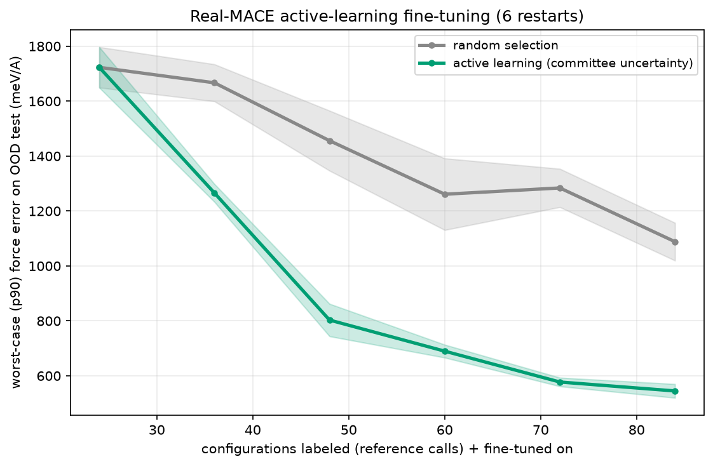

# MLIP1

**Active-learning fine-tuning of a machine-learning interatomic potential (MLIP) — the loop NVIDIA's ALCHEMI is built on, reproduced faithfully and honestly on a laptop.**

A committee of fine-tuned [MACE](https://github.com/ACEsuit/mace) foundation models selects which configurations to label with an expensive reference and fine-tune on. On the configurations that matter — the out-of-distribution regime a real molecular-dynamics run visits — this **cuts worst-case force error by 24–55% versus random selection at equal labeling budget, winning every paired restart at every budget. The reference is real DFT.**



---

## The result

Reference labels are **PBE0/def2-SVP** (PySCF), computed on every configuration in the
pool. On a held-out **out-of-distribution** test set — the hard/deployment regime — a
3-member committee of fine-tuned MACE models selecting by force disagreement:

| configs labeled | 36 | 48 | 60 | 72 | 84 |
|:---|---:|---:|---:|---:|---:|
| worst-case (p90) force error, AL better than random | +24% | +45% | +45% | **+55%** | +50% |
| restarts where AL wins | 6/6 | 6/6 | 6/6 | 6/6 | 6/6 |
| median force error, AL better | −6% | +26% | +28% | **+37%** | +21% |

Both arms share the seed set, the bootstrap draws and the training seeds, so the
comparison is **paired** and the 24-label point is identical by construction. Active
learning wins all 6 paired restarts at every budget — a one-sided sign test gives
**p = 0.016** at each point, which is a stronger statement than a mean and its band.

Student and reference share no architecture, no training data and no inductive bias:
the student is MACE fine-tuned from MACE-OFF, the labels come from Kohn–Sham DFT.
Committee disagreement tracks force error at **Spearman 0.86**.

## A universal MLIP cannot police its own training data

An earlier version of this experiment used MACE-OFF *large* as a stand-in oracle —
standard practice for a methods demonstration, since real DFT across a pool × 6
restarts × 5 budgets is normally a cluster job. Here the molecules are 6–9 atoms, so
it is 36 minutes: 536 configurations at PBE0/def2-SVP, 536/536 SCF converged.

Running it changed the headline very little (+26–59% → +24–55%) but exposed something
worth knowing. **MACE-OFF saturates on distorted geometries.** It is trained on SPICE
— near-equilibrium MD at 300–500 K — and has never seen a 0.66 Å bond, so instead of
climbing the repulsive wall it flattens:

| | real DFT | MACE-OFF large label |
|:---|---:|---:|
| worst configurations, max \|F\| | **40–80 eV/Å** | 10–23 eV/Å |
| highest label anywhere in the pool | 39.6 eV/Å | 27.2 eV/Å |

The pool builder filters unphysical configurations at `|F|max >= 40 eV/Å`. Measured
with the saturating model, **nothing ever reached the threshold** — the filter had
never once fired, and near-dissociated geometries passed straight through. Half the
held-out test set carried a bond under 0.9 Å. Against real DFT the same filter
removes 42 configurations, 7.8% of the pool.

The lesson generalises past this repository: a universal MLIP is the wrong instrument
for deciding which configurations are too distorted to train on, because the regime
where it fails is exactly the regime where it stops reporting that it is failing.

## The point most people miss

Getting active learning to beat random took getting **three conditions** right — and each was found by a real null result, not assumed:

1. **Reducible uncertainty** — the model being fine-tuned must be high-capacity (the *real* MACE), so its uncertainty reflects missing *data*, not missing representational capacity. A lightweight surrogate gave disagreement-vs-error correlation 0.38 and lost to random; the real MACE committee gives 0.86 and wins.
2. **Distribution shift** — evaluate on the deployment/OOD regime. On an i.i.d. test, random selection is near-optimal *by construction*, and active learning ties or loses.
3. **The right objective** — worst-case reliability (a single large force error crashes an MD run), not average error, which is dominated by the easy bulk that random samples well.

Get any one wrong and random ties or wins. Diagnosing *which* is the actual skill — see [`DESIGN.md`](DESIGN.md) for the full path through the dead ends to the working method.

## Run it

```bash
python -m venv .venv && .venv/bin/pip install -r requirements.txt
.venv/bin/python scripts/build_ft_pool.py        # generate + reference-label the pool, OOD split
.venv/bin/python scripts/run_real_al.py --outdir results --members 3 --epochs 80 --restarts 6
```

MACE runs in float64, which on a Mac means CPU (PyTorch's Metal/MPS backend has no float64 — one concrete reason production atomistics is CUDA-native). A full 6-restart run is a few hours on CPU; each committee fine-tune is ~2 minutes.

- `scripts/build_ft_pool.py` — configuration pool + reference labels, with the OOD test split
- `scripts/run_real_al.py` — the committee active-learning loop (real MACE fine-tuning)
- `scripts/validate_finetune.py` — confirms fine-tuning reduces held-out force error
- `scripts/probe_committee.py` — the precondition check (disagreement vs. error)
- `probe_signal.py`, `probe_tail.py`, `scripts/run_al.py` — the documented **dead ends** (surrogate approach, wrong pools), kept because the path is the point

## ⚠️ Data & license — read this

The code in this repository is **MIT** (see `LICENSE`). Two honest notes about what it runs on:

- **Scope of the DFT.** Reference labels are PBE0/def2-SVP on 6–9-atom organic molecules — a hybrid functional at a double-zeta basis, adequate for forces on this system and cheap enough to run the whole pool, but not a converged benchmark. The fine-tune is therefore a level-of-theory transfer: MACE-OFF is trained at ωB97M-D3(BJ)/def2-TZVPPD, so the student is being moved onto a different reference surface (run with `--e0s average`, which refits the atomic baselines). `scripts/build_ft_pool.py` is kept for the MACE-oracle variant; `scripts/build_dft_pool.py` is the DFT path.
- **The default model weights (MACE-OFF) are non-commercial** (Academic Software License). For a fully permissive, and more materials-relevant, setup, swap to **MACE-MP** (`mace_mp`, Materials-Project-trained, permissive) on inorganic structures — the code and every finding transfer directly. That swap is the recommended path for any commercial or fully-open use.

## What this demonstrates

MLIP · foundation models for atomistic simulation (MACE) · fine-tuning a foundation potential · committee-uncertainty active learning · when active learning helps and when it doesn't · robust-number discipline (every too-good result here was an artifact, caught and discarded).

## License

Code: MIT. Model weights and any generated labels inherit their upstream terms (see above).
